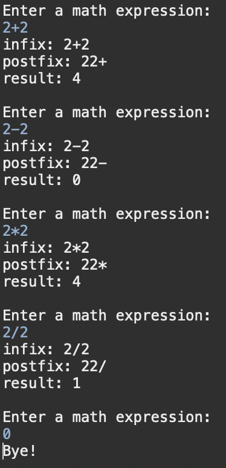
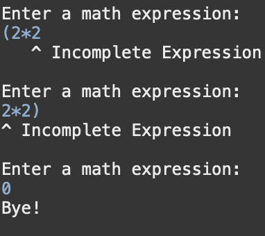

# Arithmetic Expression Evaluator

Welcome to my Expression Evaluator!

## Table of Contents
  - [Overview](#overview)
  - [App File Structure](#app-file-structure)
  - [Features](#features)
  - [Screenshots](#screenshots)
  - [Technologies Used](#technologies-used)
  - [Installation and Operation](#installation-and-operation)
  - [Future Considerations](#future-considerations)
## Overview

This program prompts the user to input an expression which is then converted to postfix notation and subsequently evaluated. After each expression entry, the expression evaluator returns the infix and postfix notation and the final result.

## App File Structure
The following is a brief overview of the file structure

[./src](https://github.com/voyagerfan/Arithmetic-Expression-Evaluator/tree/main/src) - All Java files.

[./src/MyExpressionTest.java](https://github.com/voyagerfan/Arithmetic-Expression-Evaluator/blob/main/src/MyExpressionTest.java) - Main entry point for the program

[./src/ExpressionEvaluation.java](https://github.com/voyagerfan/Arithmetic-Expression-Evaluator/blob/main/src/MyExpressionTest.java) - Checks the expression for errors and returns the infix notion

[./src/InfixToPostfix.java](https://github.com/voyagerfan/Arithmetic-Expression-Evaluator/blob/main/src/InfixToPostfix.java) - Converts the infix string to postifx notation.

[./src/PostfixEvaluation.java](https://github.com/voyagerfan/Arithmetic-Expression-Evaluator/blob/main/src/PostfixEvaluation.java) - Recevies the postfix string and returns a the result.

## Features

The program includes the following features:

* Simplistic architecture.
* Supports operators "+", "-", "*" and "/"
* User input validation for correct number of open/closing parenthesis.
* Informs a user of the position of a missing parenthesis.
* Customized user prompt for an expression.
* An indefinite loop to continue requesting input. The loop is terminated with an exit command.

## Screenshots

Differnent Operators, inputs and results

Error Checking and notification

## Technologies Used

- **Programming Languages:** Java
- **Tools:** Eclipse

## Installation and Operation

*Prerequistes:* **Java Development kit**, **an IDE** 

To run this program, you will need to install an IDE (e.g. [Eclipse](https://www.eclipse.org/downloads/) or [IntelliJ](https://www.jetbrains.com/help/idea/installation-guide.html#toolbox)) and the [Java Development Kit](https://www.oracle.com/java/technologies/downloads/).

Once you have installed an IDE, you may clone the repo and open the project folder or create your own project and copy the java files from the [src](https://github.com/voyagerfan/Arithmetic-Expression-Evaluator/tree/main/src) folder. After the java files are added, you may run the project through the IDE.

## Future Considerations
* Functional Enhancements
  * Add additional operators, constants (pi, e,), logs (ln(), log()).
  * Making the input compatible with scientific notation
* UI improvements
  * Moving the UI to a GUI
  * Adding more informative messaging for the user
* Error Handling
  * Account for more diverse collection of possible inputs
* Packaging of program
  * Add executables for Windows and Mac
  * Add an option to run the program with a jar file.

