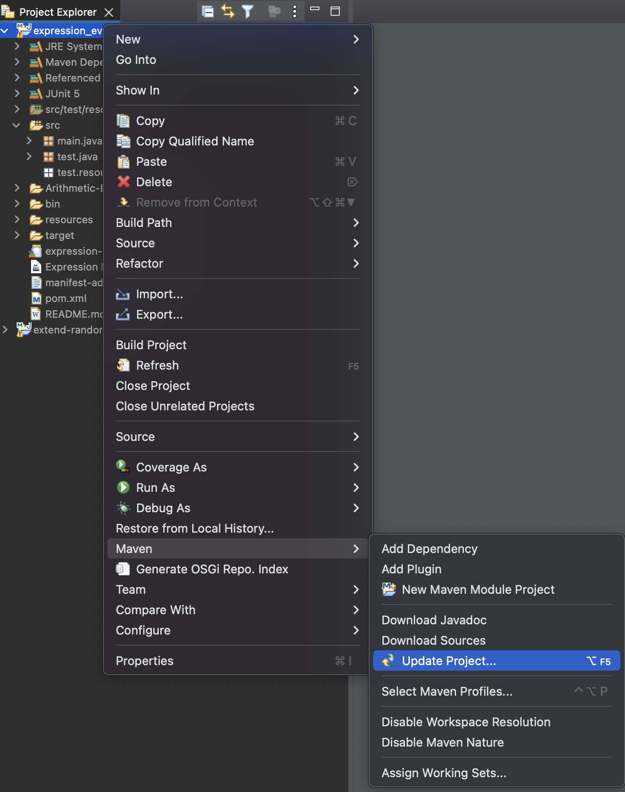
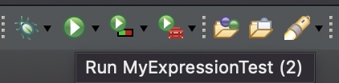
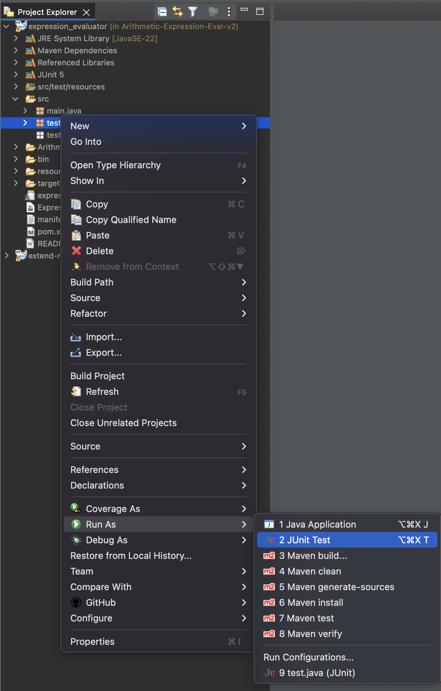

# Arithmetic Expression Evaluator

Welcome to my Expression Evaluator!

## Table of Contents

- [Arithmetic Expression Evaluator](#arithmetic-expression-evaluator)
  - [Table of Contents](#table-of-contents)
  - [Overview](#overview)
  - [App File Structure](#app-file-structure)
  - [Features](#features)
  - [Screenshots](#screenshots)
  - [Technologies Used](#technologies-used)
  - [Installation, Operation and Testing](#installation-operation-and-testing)
    - [Installation and Operation](#installation-and-operation)
    - [Testing Instructions](#testing-instructions)
  - [Future Considerations](#future-considerations)
## Overview

This program prompts the user to input an expression which is then converted to postfix notation and subsequently evaluated. After each expression entry, the expression evaluator returns the infix and postfix notation and the final result.

## App File Structure
The following is a brief overview of the file structure

[./src](https://github.com/voyagerfan/Arithmetic-Expression-Evaluator/tree/main/src) - All Java files.

[./src/test/java/TestExpression.java](https://github.com/voyagerfan/Arithmetic-Expression-Evaluator/blob/main/src/test/java/TestExpressions.java) - JUnit Testning Suite

[./src/main/java/MyExpressionTest.java](https://github.com/voyagerfan/Arithmetic-Expression-Evaluator/blob/main/src/main/java/MyExpressionTest.java) - Main entry point for the program

[./src/main/java/ExpressionEvaluation.java](https://github.com/voyagerfan/Arithmetic-Expression-Evaluator/blob/main/src/main/java/ExpressionEvaluation.java) - Checks the expression for errors and returns the infix notation

[./src/main/java/InfixToPostfix.java](https://github.com/voyagerfan/Arithmetic-Expression-Evaluator/blob/main/src/main/java/InfixToPostfix.java) - Converts the infix string to postifx notation.

[./src/main/java/PostfixEvaluation.java](https://github.com/voyagerfan/Arithmetic-Expression-Evaluator/blob/main/src/main/java/PostfixEvaluation.java) - Recevies the postfix string and returns a the result.

## Features

The program includes the following features:

* Simplistic architecture.
* JUnit testing suite
* Supports operators "+", "-", "*" and "/"
* User input validation for correct number of open/closing parenthesis.
* Informs a user of the position of a missing parenthesis.
* Customized user prompt for an expression.
* An indefinite loop to continue requesting input. The loop is terminated with an exit command.


## Screenshots

Differnent Operators, inputs and results


Error Checking and notification


## Technologies Used

- **Programming Languages:** Java
- **Tools:** Eclipse
- **Testing Framework:** Junit

## Installation, Operation and Testing
>[!NOTE] 
> The following instructions are intended for Eclipse. You may follow a similar path for other Java compatible IDE's

### Installation and Operation
*Prerequistes:* **Java Development kit**, **an IDE** 

To run this program, you will need to install an IDE (e.g. [Eclipse](https://www.eclipse.org/downloads/) or [IntelliJ](https://www.jetbrains.com/help/idea/installation-guide.html#toolbox)) and the [Java Development Kit (JDK)](https://www.oracle.com/java/technologies/downloads/).

Once you have installed an IDE and JDK, you may clone the repo and open the project folder in the IDE. Next, sync the project settings and compile the code.

Sync the project with dependencies in pom.xml
* Right click on the project folder
* select **Maven** -> **Update Project**


Compile the java code:
* cd into the project directory
* enter the following
  ```bash
  mvn clean install
  ```
You may now run the program by clicking the first green play button (far left) 



### Testing Instructions
There are 2 options available to run the testing suite.

Option 1: JUnit
* Right click on the **test.java** package
* select **Run As** -> **JUnit Test**
  

Option 2: Use Maven to run the testing suite
* cd in the the project project directory
* Enter the following:
  ```bash
  mvn test
  ```

## Future Considerations
While this program provides some key features and highlights basic programming concepts, it is limited in terms of input handling, UI and operator features. These limitations have prompted the consideration of the following future improvements:

* Functional Enhancements
  * Add additional operators, constants (pi, e,), logs (ln(), log()).
  * Making the input compatible with scientific notation
* UI improvements
  * Moving the UI to a GUI
  * Adding more informative messaging for the user
* Error Handling
  * Account for more diverse collection of possible inputs
* Packaging of program
  * Add executables for Windows and Mac
  * Add an option to run the program with a jar file.

